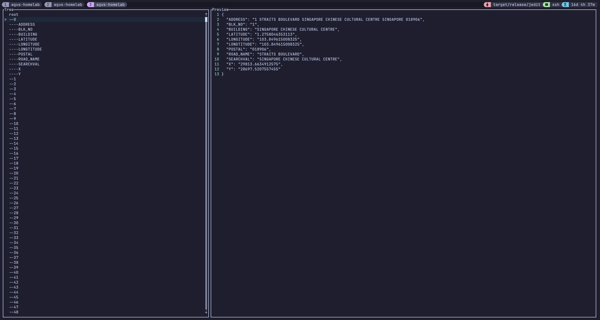

# Jedit

[](https://github.com/aguss787/jedit/actions/workflows/test.yml)


[](https://github.com/aguss787/jedit/blob/master/LICENSE)

**Jedit** is a command-line tool to view and edit large JSON file directly within your terminal.



## Installation

To install Jedit, ensure you have [Rust](https://www.rust-lang.org/tools/install) installed, then run:

```bash
git clone https://github.com/aguss787/jedit.git
cd jedit
cargo build --release
```

## Usage

```bash
$ jedit --help

View and edit JSON file

Usage: jedit [OPTIONS] <INPUT>

Arguments:
  <INPUT>  JSON file to edit

Options:
  -o, --output <OUTPUT>  Output file to write to. Defaults to overwrite the input file
  -h, --help             Print help
```

## Keybind

| Key               | Action                 |
| ----------------- | ---------------------- |
| q                 | Exit                   |
| k / Up            | Up                     |
| j / Down          | Down                   |
| l / Enter / Space | Expand                 |
| Ctrl + u          | Up 10                  |
| Ctrl + d          | Down 10                |
| g                 | Move to top            |
| G                 | Move to bottom         |
| h                 | Close                  |
| p                 | Toggle preview         |
| e                 | Edit value             |
| w                 | Save                   |
| K                 | Preview up             |
| J                 | Preview down           |
| Ctrl + U          | Preview up 5           |
| Ctrl + D          | Preview down 5         |
| H                 | Preview left           |
| L                 | Preview right          |
| Ctrl + Left       | Preview window bigger  |
| Ctrl + Right      | Preview window smaller |

## Missing feature

- [ ] Custom keybind
- [ ] Search
- [ ] Inline key operation
  - [ ] Add new key
  - [ ] Delete key
- [ ] Prettier error message
